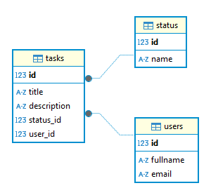

# Вступ до вивчення систем управління базами даних

## 📋 Огляд завдань

Цей репозиторій містить виконання завдань з вивчення систем управління базами даних (СУБД). Завдання включає практичну роботу з PostgreSQL та MongoDB.

## 🎯 Завдання 1: PostgreSQL - Система управління завданнями

### 📝 Опис завдання
Створити базу даних для системи управління завданнями з використанням PostgreSQL. Реалізувати таблиці для користувачів, статусів завдань і самих завдань. Виконати набір SQL запитів для роботи з даними.

### 🏗️ Структура бази даних


#### Таблиця `users`
- `id` - SERIAL PRIMARY KEY (автоінкремент)
- `fullname` - VARCHAR(100) NOT NULL (повне ім'я користувача)
- `email` - VARCHAR(100) UNIQUE NOT NULL (унікальна електронна адреса)

#### Таблиця `status`
- `id` - SERIAL PRIMARY KEY (автоінкремент)
- `name` - VARCHAR(50) UNIQUE NOT NULL (унікальна назва статусу)

**Базові статуси:** 'new', 'in progress', 'completed'

#### Таблиця `tasks`
- `id` - SERIAL PRIMARY KEY (автоінкремент)
- `title` - VARCHAR(100) NOT NULL (назва завдання)
- `description` - TEXT (опис завдання)
- `status_id` - INTEGER NOT NULL (зовнішній ключ на status.id)
- `user_id` - INTEGER NOT NULL (зовнішній ключ на users.id з каскадним видаленням)

### 🔧 Особливості реалізації

#### Обмеження та зв'язки
- ✅ **Унікальні поля:** `users.email`, `status.name`
- ✅ **Каскадне видалення:** При видаленні користувача автоматично видаляються всі його завдання
- ✅ **Зовнішні ключі:** `tasks.user_id → users.id`, `tasks.status_id → status.id`

#### Тестові дані
- **10 користувачів** з українськими іменами (генерація через Faker)
- **30 завдань** з описами
- **3 статуси** з автоматичним розподілом

### 📁 Файли завдання 1

```
task1/
├── docker-compose.yml      # Конфігурація PostgreSQL контейнера
├── create_tables.py        # Скрипт створення таблиць
├── seed.py                 # Скрипт заповнення даними
├── queries.py              # Python скрипт для виконання запитів з файлу
├── queries.sql             # SQL файл з усіма 14 запитами
└── requirements.txt        # Залежності Python
```

### 🚀 Швидкий старт

1. **Запуск бази даних:**
   ```bash
   cd task1
   docker-compose up -d
   ```

2. **Встановлення залежностей:**
   ```bash
   pip install -r requirements.txt
   ```

3. **Створення таблиць:**
   ```bash
   python create_tables.py
   ```

4. **Заповнення даними:**
   ```bash
   python seed.py
   ```

5. **Виконання запитів:**
   ```bash
   python queries.py
   ```

### 🔧 Архітектура коду
- **Повна типізація:** Всі скрипти містять type hints з модулем `typing`
- **Читання з файлів:** `queries.py` читає SQL запити з окремого файлу `queries.sql`
- **Парсинг SQL:** Автоматичний парсинг коментарів та запитів з регулярними виразами
- **Обробка помилок:** Обробка винятків та закриття з'єднань

### 📊 Реалізовані SQL запити

1. **Отримання завдань користувача** - SELECT з JOIN
2. **Фільтрація за статусом** - SELECT з підзапитом
3. **Оновлення статусу** - UPDATE з підзапитом
4. **Користувачі без завдань** - SELECT з NOT IN
5. **Додавання завдання** - INSERT з підзапитом
6. **Незавершені завдання** - SELECT з JOIN та фільтрацією
7. **Видалення завдання** - DELETE
8. **Пошук за email** - SELECT з LIKE
9. **Оновлення користувача** - UPDATE
10. **Статистика за статусами** - SELECT з COUNT та GROUP BY
11. **Завдання з певним доменом** - SELECT з JOIN та LIKE
12. **Завдання без опису** - SELECT з NULL перевіркою
13. **Користувачі та завдання 'in progress'** - INNER JOIN
14. **Підрахунок завдань користувачів** - LEFT JOIN з GROUP BY

### 🛠️ Технічні деталі

- **PostgreSQL 15** (Alpine Linux контейнер)
- **Python 3.13** з psycopg2-binary 2.9.10
- **Docker Compose** для оркестрації
- **Faker 24.0.0** для генерації тестових даних з українською локалізацією
- **Повна типізація** з модулем `typing`

### ✅ Результати тестування

- ✅ Успішне створення всіх таблиць з правильними обмеженнями
- ✅ Коректне заповнення тестовими даними (10 користувачів, 30 завдань)
- ✅ Виконання всіх 14 SQL запитів з файлу queries.sql
- ✅ Перевірка каскадного видалення при видаленні користувача
- ✅ Валідація унікальних обмежень для email та назв статусів

---

## 🎯 Завдання 2: MongoDB - Система управління котами

### 📝 Опис завдання
Розробити Python скрипт, який використовує бібліотеку PyMongo для реалізації основних CRUD операцій у MongoDB. Створити колекцію котів з можливістю додавання, читання, оновлення та видалення записів.

### 🏗️ Структура документів
Кожен документ у колекції `cats` містить:
- `_id` - ObjectId (автоматично генерується MongoDB)
- `name` - String (ім'я кота, унікальне)
- `age` - Integer (вік кота)
- `features` - Array[String] (список характеристик кота)

### 🔧 CRUD операції
- ✅ **CREATE:** `create_cat()` - Додавання нового кота з валідацією унікальності імені
- ✅ **READ:** `read_all_cats()` + `read_cat_by_name()` - Показ всіх котів та пошук за іменем
- ✅ **UPDATE:** `update_cat_age()` + `add_cat_feature()` - Оновлення віку та додавання характеристик
- ✅ **DELETE:** `delete_cat_by_name()` + `delete_all_cats()` - Видалення одного кота або всіх котів

### 📁 Файли завдання 2

```
task2/
├── docker-compose.yml      # MongoDB 7.0 контейнер з автентифікацією
├── init-mongo.js           # Ініціалізація бази даних з 5 тестовими котами
├── main.py                 # Основна програма (450+ рядків) з інтегрованим тестуванням
└── requirements.txt        # Python залежності (PyMongo 4.10.1)
```

### 🚀 Швидкий старт

1. **Запуск MongoDB:**
   ```bash
   cd task2
   docker-compose up -d
   ```

2. **Встановлення залежностей:**
   ```bash
   pip install -r requirements.txt
   ```

3. **Запуск програми:**
   ```bash
   # Інтерактивний режим з 8 опціями меню
   python main.py
   
   # Автоматичне тестування (9 комплексних тестів)
   python main.py --test
   ```

### 🎯 Інтерактивне меню

```
🐱 СИСТЕМА УПРАВЛІННЯ БАЗОЮ ДАНИХ КОТІВ 🐱
==================================================
1. Показати всіх котів
2. Знайти кота за іменем
3. Додати нового кота
4. Оновити вік кота
5. Додати характеристику коту
6. Видалити кота за іменем
7. Видалити всіх котів
8. Вийти з програми
==================================================
```

### 🧪 Система тестування

Програма включає **9 автоматичних тестів:**

1. **Показ всіх котів** - перевірка коректного відображення
2. **Пошук за іменем** - існуючий та неіснуючий кіт
3. **Створення кота** - успішне додавання та блокування дублікатів
4. **Оновлення віку** - зміна віку існуючого кота
5. **Додавання характеристики** - нова характеристика та дублікат
6. **Перевірка цілісності** - валідація оновленого кота
7. **Видалення кота** - успішне видалення та повторна спроба
8. **Валідація вводу** - перевірка користувацьких даних
9. **Безпечне масове видалення** - з підтвердженням

**Результат:** `🎯 РЕЗУЛЬТАТ: 9/9 тестів пройдено 🎉 ВСІ ТЕСТИ ПРОЙДЕНО УСПІШНО!`

### 🏆 Особливості реалізації

- **Повна типізація:** Type hints для всіх функцій та змінних
- **Комплексна обробка помилок:** PyMongoError, ConnectionFailure, загальні винятки
- **Валідація даних:** Перевірка унікальності імен, валідація віку, очищення вводу
- **Емодзі UX:** Візуально привабливий інтерфейс з кольоровим форматуванням
- **Автоматичне тестування:** Вбудована система з 9 комплексними тестами
- **Docker готовність:** Повністю контейнеризована MongoDB з автентифікацією

### 🔧 Технічні деталі

- **MongoDB 7.0** (Alpine Linux контейнер)
- **PyMongo 4.10.1** (Python драйвер для MongoDB)
- **Python 3.13** з повною типізацією
- **База даних:** `cats_db` з колекцією `cats`
- **Автентифікація:** `cats_user:cats_password`
- **Тестові дані:** 5 котів з різними характеристиками

### ✅ Результати тестування

- ✅ Всі 9 автоматичних тестів пройдено успішно
- ✅ Всі 8 опцій меню працюють коректно
- ✅ Повна валідація користувацького вводу
- ✅ Обробка всіх можливих помилок MongoDB
- ✅ Каскадна перевірка цілісності даних
- ✅ Безпечне підключення та закриття з'єднань

---

## 🎯 Загальний підсумок проєкту

- Практичний досвід роботи з реляційними (PostgreSQL) та NoSQL (MongoDB) базами даних
- Розуміння різниць між SQL та документо-орієнтованими підходами
- Навички контейнеризації баз даних через Docker Compose
- Досвід написання чистого, типізованого та протестованого Python коду
- Вміння створювати зручні користувацькі інтерфейси
